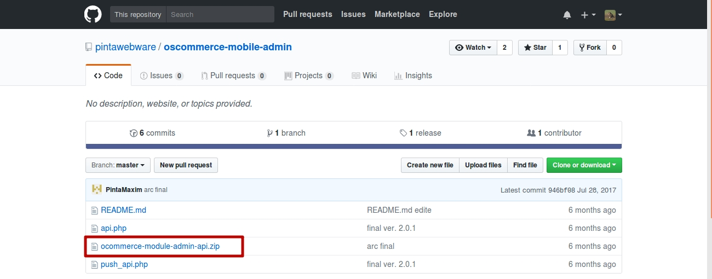
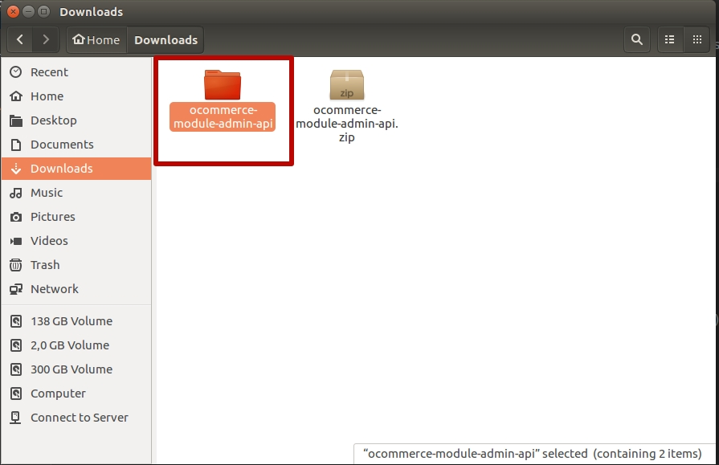
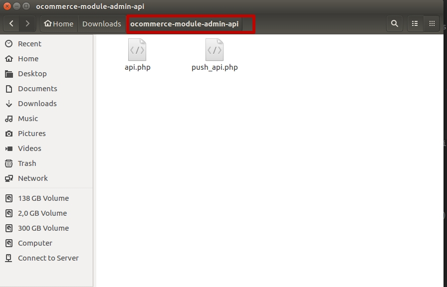
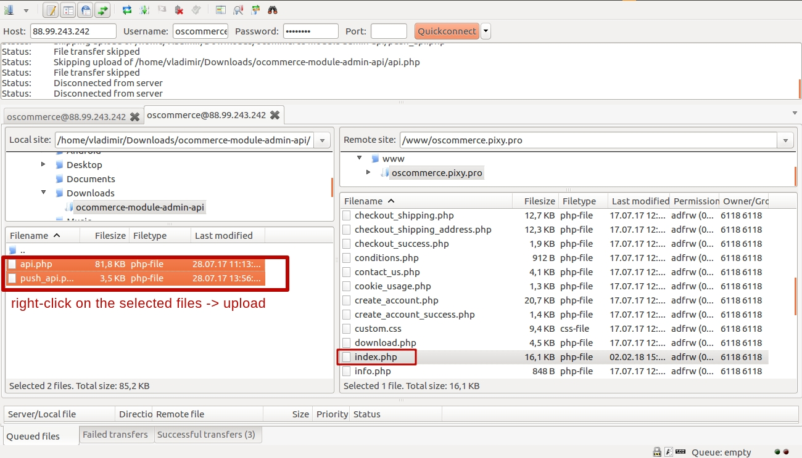
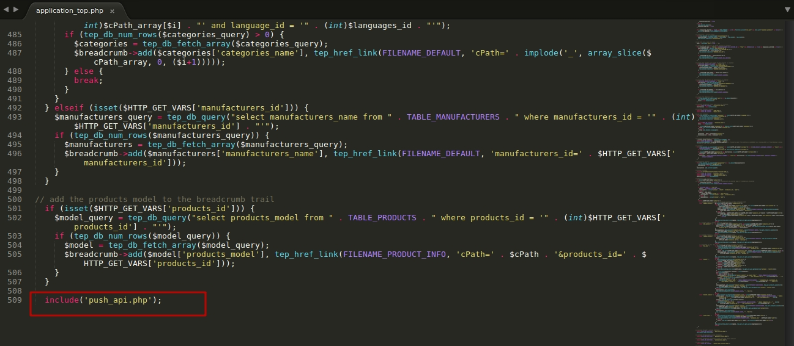

OSCOMMERCE-MOBILE-ADMIN 
=======================

Module for osCommerce version 2.0.0 and higher, containing the API for managing the online store from a mobile device.

== Installation ==

### To install extension on your website, you need to:

1. Follow the link https://github.com/pintawebware/oscommerce-mobile-admin and download the extension:

2. Extract the contents of the archive

3. Open folder with the module

4. Copy the extracted files to the root directory of the site (in the same place as index.php);

5. Edit "includes/application_top.php" file at the site: add a line "include('push_api.php');" to the end of file.

Installation is done.

#### Use this link to download applications:
* [Google Play](https://play.google.com/store/apps/details?id=com.pinta.oscommerce.oscommercemobileadmin)
* [AppStore](https://itunes.apple.com/ua/app/oscommerce-mobile-admin/id1264528368?l=ru&mt=8)
